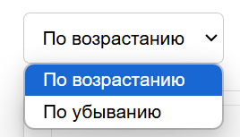

# Меню Сытого Батыра

## Описание проекта

**"Меню Сытого Батыра"** — это веб-приложение для отображения и фильтрации меню заведения.  
Оно позволяет пользователям сортировать и фильтровать список пицц по цене, а также предоставляет удобную возможность сброса фильтров для просмотра всех позиций.  

Приложение построено с использованием **Python** и **Flask** в качестве серверной части, **SQLite** для хранения данных, а также **HTML/CSS** для клиентской части.  

Данные о пиццах автоматически парсятся с сайта [sb-pizza.ru](https://sb-pizza.ru) с использованием библиотеки **BeautifulSoup** и сохраняются в базу данных SQLite.

---

## Технологический стек

- **Backend**: Flask  
- **Frontend**: HTML, CSS
- **База данных**: SQLite  
- **Парсинг данных**: BeautifulSoup  
- **Контейнеризация**: Docker  

---

## Инструкция по запуску

### 1. Предварительные требования
Для работы с проектом необходимы:
- **Python 3.10 или выше**
- **Docker** и **Docker Compose**

---

### 2. Шаги для запуска

1. **Клонируйте репозиторий:**

   git clone https://github.com/Sansan20/Project.git

2. **Переключитесь на актуальную ветку:**

   git checkout dev

3. **Соберите и запустите контейнеры:**  
   В корневой директории проекта выполните команду:

   ./build.sh

4. **Откройте приложение в браузере:**  
   После успешного запуска контейнеров перейдите по адресу:  
   [http://localhost:8080](http://localhost:8080)

---

## Файлы проекта

- **`app.py`**: Основной файл для запуска веб-приложения.  
- **`parse.py`**: Парсер для сбора данных с сайта и сохранения их в базу данных.  
- **`requirements.txt`**: Список зависимостей Python.  
- **`Dockerfile`**: Инструкция для сборки Docker-образа.  
- **`docker-compose.yml`**: Конфигурация для запуска контейнеров.  
- **`index.html`**: Шаблон страницы для отображения меню.  

---

## Возможности приложения
### 1. Фильтрация по минимальной и максимальной цене
Пользователь может указать диапазон цен, чтобы отобразить подходящие варианты.

### 2. Сортировка

Меню можно сортировать по возрастанию или убыванию цены.
### 3. Динамическое отображение данных
Приложение автоматически загружает и отображает данные из базы.
### 4. Возможность сброса фильтров

Кнопка сброса позволяет вернуться к изначальному списку позиций.

## Примечание

При каждом запуске парсер обновляет базу данных, чтобы информация оставалась актуальной.
